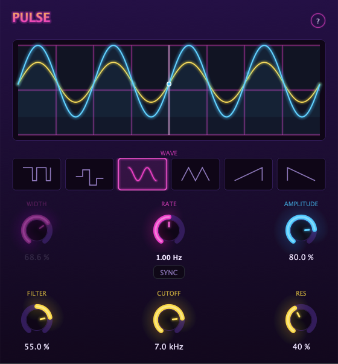

# Pulse

An LFO tremolo and resonant filter plugin, with a synthwave face.



Pulse attenuates the incoming signal with a low-frequency oscillator, and sweeps
a resonant low-pass filter from the same wave. The display scrolls right to left
with the centre line marking the current moment, so you can see the shape that is
about to hit the audio as well as the one that just did.

## Features

- **Six waveforms** — triangle, saw up, saw down, square, sine, and sample & hold.
- **Free or synced** — set the rate in Hz, or lock it to the host tempo and
  transport in note divisions.
- **Pulse width** — duty cycle for the square wave.
- **Resonant filter** — a 12 dB/oct low-pass swept by the same LFO. Resonance
  runs from Butterworth (Q 0.7) to a strong peak (Q 10).
- **Bipolar filter envelope** — positive opens the filter along with the wave,
  negative inverts it so the wave's peak closes the filter. At zero the filter
  is bypassed entirely.
- **Built-in user guide** — the `?` in the header opens it. It is compiled into
  the binary, so it ships with every format and never goes missing.

## Controls

| Control | Range | Notes |
| --- | --- | --- |
| Wave | 6 shapes | Sets the LFO shape |
| Width | 0–100 % | Square-wave duty cycle; ignored by other shapes |
| Rate | Hz, or note divisions | Sync button locks it to the host |
| Amplitude | 0–100 % | How deeply the LFO attenuates the signal |
| Filter | −100 to +100 % | Filter envelope depth; 0 bypasses the filter |
| Cutoff | 80 Hz – 20 kHz | The ceiling the envelope sweeps down from |
| Res | Q 0.7 – Q 10 | Butterworth through to a strong peak |

## Downloads

Builds are on the [Releases](https://github.com/invertedworld/pulse/releases) page.

| Platform | Formats | Notes |
| --- | --- | --- |
| macOS 10.13+ | AU, VST3, Standalone | Universal binary (Apple Silicon + Intel), signed and notarized |
| Windows 10+ | VST3, Standalone | x64. See the code signing policy below |

### Installing

On **macOS**, run the installer. It offers a choice of destination: for all users
(system folders, needs an admin password) or for the current user only
(`~/Library/Audio/Plug-Ins`, no admin needed).

On **Windows**, copy `Pulse.vst3` into `C:\Program Files\Common Files\VST3`.
`Pulse.exe` is the standalone and runs from anywhere.

## Building from source

Pulse depends only on [JUCE](https://juce.com), which CMake fetches for you at
configure time. No manual setup is needed.

```sh
# macOS — builds a universal binary and deploys to ~/Library/Audio/Plug-Ins
./build.sh

# Any platform
cmake -S . -B build -DCMAKE_BUILD_TYPE=Release
cmake --build build --config Release
```

Artefacts land in `build/Pulse_artefacts/Release/`.

Windows builds are produced by [CI](.github/workflows/build.yml) on every push,
so you do not need a Windows machine to build for Windows.

## Code signing policy

**macOS** builds are signed and notarized with an Apple Developer ID.

**Windows** builds are currently **unsigned**. SmartScreen will warn on first
run; this is expected, and you can proceed via *More info → Run anyway*. Verify
downloads came from the Releases page above.

**Privacy:** This program will not transfer any information to other networked
systems unless specifically requested by the user or the person installing or
operating it. Pulse is built with networking disabled (`JUCE_WEB_BROWSER=0`,
`JUCE_USE_CURL=0`) and has no telemetry, licence check, or update mechanism.

**Team roles:** Pulse is maintained by a single author,
[@invertedworld](https://github.com/invertedworld), who acts as author, reviewer
and release approver.

## Licence

Pulse is licensed under the [GNU Affero General Public License v3.0](LICENSE).

It is built with JUCE, which is dual-licensed under the AGPLv3 and a commercial
licence. Pulse uses JUCE under the AGPLv3, which is why Pulse itself is AGPLv3 —
if you distribute a modified version, you must publish your source under the same
terms.
